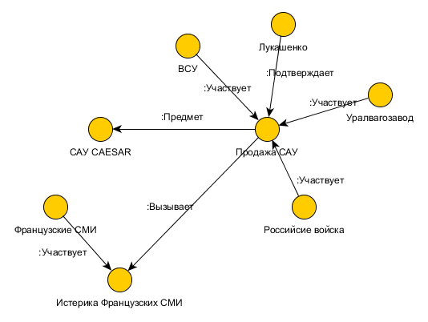
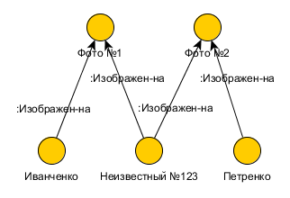
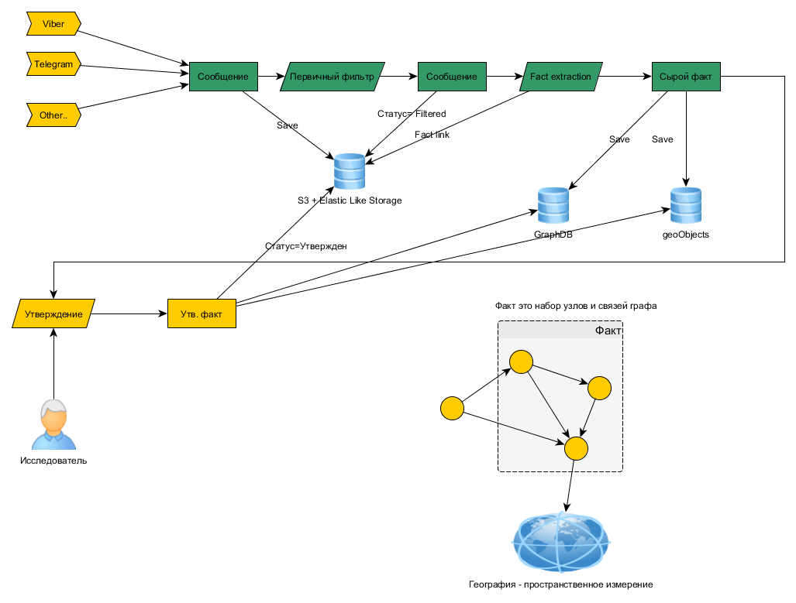
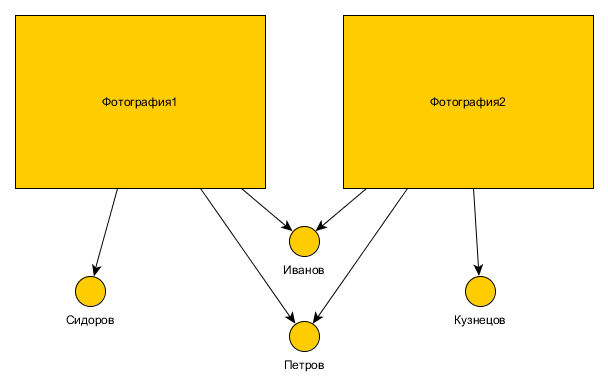

# Обзор

Главная задача системы: анализ неявных взаимосвязей людей, событий, решений 
через отражение интересуемого аспекта реальности в виде семантического графа,
выявление объектов реального мира и их связей между собой, 
отражение событий, развивающихся во времени и пространстве.

## Определения

* Узел графа - отражение сущностей и категорий реального мира.
* Связь - категоризированные отношения между сущностями.
* Факт - установленное множество узлов и связей отражающих какое-либо событие, процесс, явление. 

Узел графа в тексте будет заключаться в круглые скобки: (Киев)

Связь - будет обозначаться стрелкой с описанием внутри стрелки: -ВКЛЮЧАЕТ_В_СЕБЯ->
Тот факт, что Львов в данный момент входит в состав Украины будем записывать как:
(Украина) -ВКЛЮЧАЕТ_В_СЕБЯ-> (Львов)

## Виды узлов
* Игрок (Субъект, Физлицо, Организация, Страна, Блок стран, Объединение, Воинское объединение, Воинская часть и тд)
* Экземпляр (Артефакт, Предмет реального мира: Танк, Ракета, компьютер, город; предмет виртуального мира: пост в соцсети, СМС, фотография, видеозапись))
* Событие, Явление, Процесс (Война, Перегруппировка, Финансирование, Снабжение, Бой, Расстрел, Пленение, Взрыв,  Огневое поражение и тд)
* Понятия (Абстрактные сущности, Виды и типы объектов)

## Виды связей
[см тут](http://www.recyclebin.ru/BMK/APIP/l1.pdf)
* Общелогические (Род -> Вид, Целое -> Часть, Класс -> Экземпляр)
* Пространственные (у нас - задаются вне графа, например точкой на карте)
* Временные (Предыдущее -> Последующее)
* Причинно-следственные (Участие, Бенефициар, Пострадавший, Активизация)


## О фактах
Процесс описания в виде графа требует стандартизации, для того, чтобы разные люди описывали информацию
одинаково, что в свою очередь нужно для упрощения, автоматизации исследований и поиска.
Например факт: город Львов находится на Украине можно описать по-разному. Например
* (Украина) =ВКЛЮЧАЕТ-В-СЕБЯ=> (Львов)
* (Львов) =ВХОДИТ-В-СОСТАВ=> (Украина)
* (Львов) =НАХОДИТСЯ-НА=> (Украина)
* (Львов является городом Украины) 

Последний пример - вообще вырожденный случай, тут все описано вообще одним узлом!

В целях стандартизации число типов связей нужно ограничить относительно небольшим набором. 
Решение о введении нового типа связей нужно принимать только в случае если невозможно какой либо факт 
описать существующими связями.

### Правила описания фактов

* Не плодить сущности (узлы) без нужды, стараться пользоваться тем что есть.
* Использовать те типы связей, что есть. Создание нового типа - исключительная ситуация.
* Для указания сущности выбирать наиболее конкретную, специфичную, меньшую по размеру, значимости.
* При создании связи использовать направления:
  * от субъекта к объекту
  * от целого к части
  * от инициатора к событию 
  * от причины к следствию

### Пример 1
Разберем факт:
>Лукашенко вызвал настоящую истерику во французских СМИ, объяснив про САУ CAESAR, которые украинцы продали русским войскам, и которые оказались в Уралвагонзаводе.

Здесь имеется в виду, если убрать эмоциональные нотки, что Лукашенко **подтвердил**, что САУ CAESAR
были проданы военными украины русским войскам и оказались на Уралвагозаводе, и французские СМИ от этого в истерике.

Разбираемый текст, описывает событие, которое представляет интереc, имеет самостоятельное значение,
поэтому введем узел с типом Событие, назовем его достаточно конкретно "Продажа САУ CAESAR"

Выделим здесь ключевых игроков, объекты и их роли по отношению к событию: 
* Украинские войска, Русские войска, Уралвагозавод - участники события,
* Лукашенко - лицо, подтверждающее событие
* САУ CAESAR - предмет события 

Допустим, для наших целей важна 
реакция иностранных государств, тогда можно выделить еще одно событие: Истерика Французских СМИ, и 
участниками этого события будут конечно же Французские СМИ, офигевающие от этого всего.

Получаем такой граф:



Если не известно более "мелкое" подразделение, а только "Украинские войска", то будем использовать этот узел, 
наверняка он уже будет в системе. Если же известно, что это сделала например 95 одшбр, то надо указывать ее, 
тк по связям можно будет проследить, что это в итоге Украинские войска.

В дальнейшем, если будут выясняться какие-то подробности, более крупные участники могут быть уточнены на 
подразделения, потом и на конкретных лиц. Роли при этом могут поменяться: нейтральное "Участвует", может 
стать более точным "Являться бенефициаром", "Являться потерпевшим"

Использование глаголов в определениях типов связей упрощает правильную установку направления стрелки, 
например, здесь оба варианта кажутся правильными и вызывают путаницу:
```
(Пупкин Василий) =БЕНЕФИЦИАР=> (Продажа САУ CAESAR)
(Продажа САУ CAESAR) =БЕНЕФИЦИАР=> (Пупкин Василий)
```
В сравнении с немного угловатым, но однозначным:
```
(Пупкин Василий) =ЯВЛЯЕТСЯ-БЕНЕФИЦИАРОМ=> (Продажа САУ CAESAR)
```

### Пример 2
К нам попал набор из двух фотографий, из которых мы (как-то - пока не определено как), установили, что там 
Иванченко, Петренко и некто неизвестный. Выделим ключевых игроков, объекты и их роли:
* фотографии - объекты типа Фото
* Иванченко, Петренко и некто неизвестный - Игроки, роль: изображены на фото.



Из графа становится понятно, что Неизвестный достаточно важен и требуется установление его личности. Если
Иванченко и Петренко служат в одной бригаде, то личность можно установить по другим фото бригады.

## Роли пользователей системы
* Админ - администратор системы
* Согласущий - ответственный за качество данных, утверждает все изменения графа
* Исследователь - сотрудник осуществляющий поиск и подготовку информации на утверждение, вывод на основе информации графа.

## Техпроцесс извлечения фактов



Сообщение это текст или html, который сохраняем в S3 хранилище в том виде в котором его получили.

Первичный фильтр отсекает лишний спам на основе ключевых слов или как-то еще - пока обсуждаемо.

Извлечение фактов - автоматический процесс формирования сырого факта.

Факт - в системе - это подграф, состоящий из сущностей и связей, 
возможно опирающийся на географию и время.

Сырой факт прежде чем быть включенным в работу - просматривается исследователем,
который должен иметь возможность получить исходное сообщение, из которого сформирован факт.

После утверждения факта он включается в общий граф и используется для работы.

## Техпроцесс пакетной загрузки сырых фактов (фото-фактов)
Фото-факт это фотография и связанный с нею разбор на составляющие: лица, место, время, 
какие-то другие распознаваемые объекты. Причем сама фотография также является узлом графа.



Пакет с данными - zip-архив содержит файлы фото (jpg, png ..) и файлы разметки (yaml), которая показывает кто и где на фото.
Имена файлов должны совпадать. 

Разметка:
```yaml
src: uri://foto.ua/foto1.jpg        # (Optional) Источник фото (TODO - хватит ли простого URL?) 
description: Описание фото          # (Optional) Описание - произвольный текст если нужен
location:                           # (Optional) Место съемки, одно из следующих: point, uid
    point:                          # Точка
      lat: 41.123                       # Широта
      lon: 33.123                       # Долгота
      r:   1000                         # Радиус - если место точно не определено
    uid: 22345200-abe8-4f60-90c8-0d43c5f6c0f6   # Уникальный идентификатор места (из нашей базы)
content:                            # (Optional) Распознанное содержимое - список
   - type: person
     confidence: 0.65               # (Optional) Оценка распознавания 
     rect: [10, 10, 20, 20]         # (Optional) Прямоугольник, где найдено лицо [x,y,w,h]
     name: Иванов Иван Иванович     # (Optional) ФИО - см примечание
     uid:  22345200-abe8-4f60-90c8-0d43c5f6c0f6 # uid лица в системе (из нашей базы) либо внутри пакета - см примечание
tags:                               # (Optional) - список тегов для фото 
    - tag1
    - tag2
```
При распознавании лиц крайне важно не плодить сущности: один и тот же человек (или вообще - один и тот же объект) на нескольких фото 
в пакете должен иметь один и тот же идентификатор, при этом его ФИО может оставаться неизвестным.

При утверждении фактов пакета лица могут остаться неизвестными либо "слиться" в одну сущность, которая уже находится в базе.
Процесс слияния может быть ручным (TODO автоматическим?).

TODO: Подумать над дополнительными данным для людей на фото - пол, возраст, подразделение и тд

Фото должно храниться хранилище типа S3. 
Факт импорта - в БД, сам пакет в S3?
